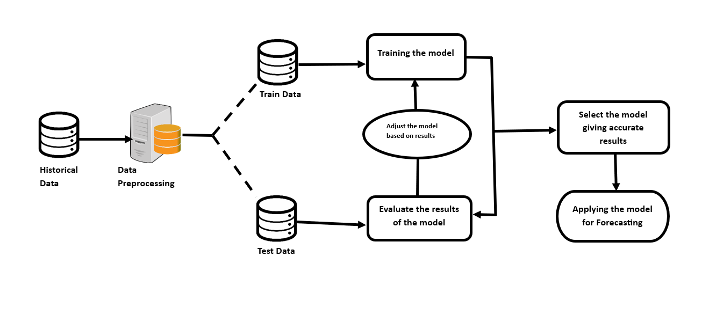
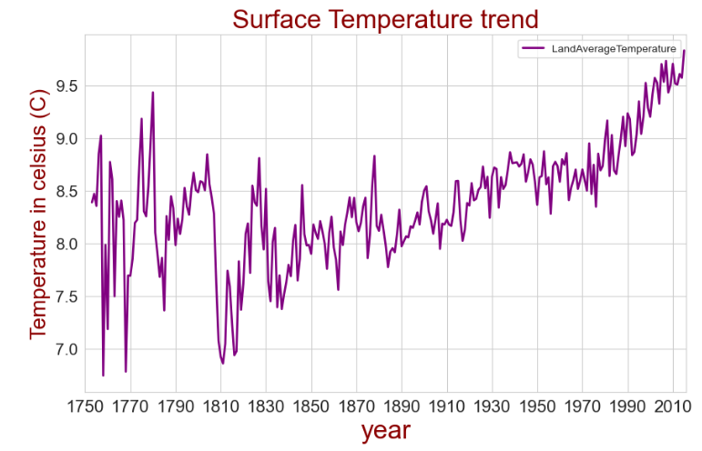
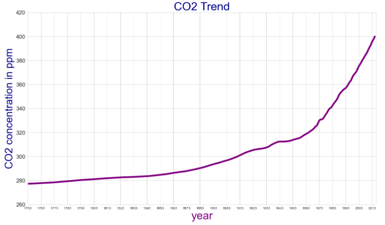

ANALYSIS AND PREDICTION OF GLOBAL WARMING

The project seeks to employ advanced machine learning methodologies to analyze historical climate data, predict future temperature trends, and assess the influence of greenhouse gas emissions on global warming.

## About
<!--Detailed Description about the project-->
Global warming stands as one of the most important challenges of our time, with far-reaching consequences for the environment, ecosystems, and human societies. As the Earth's climate continues to undergo unprecedented changes, there is an urgent need for comprehensive analyses and accurate predictions to guide mitigation efforts. This project endeavors to address this imperative by conducting an in-depth investigation into global warming trends, utilizing three key datasets—Earth surface temperature, CO2 emissions, and world population data. The integration of advanced machine learning models, including SARIMAX, ARIMAX, VAR, and VECM, enhances our ability to discern intricate patterns and forecast future climate dynamics.

## Features
<!--List the features of the project as shown below-->
- accurate predictions of future temperature trends.
- insights into the relationships between temperature and greenhouse gas emissions.
- identification of key factors driving global warming
- High Accuracy.
-Visualization of results through graphs and plots for clear presentation and communication of findings.
- Contribution to scientific knowledge and policy formulation regarding climate change mitigation and adaptation.
## Requirements
<!--List the requirements of the project as shown below-->
* Operating System: Requires a 64-bit OS (Windows 10 or Ubuntu).
* Development Environment: Python 3.6 or later is necessary for coding.
* Machine Learning Algorithms: SARIMAX, ARIMAX, VAR, VECM for analysing and forecasting surface temperature.
*  Libraries: Pandas, Numpy, Matplotlib, Seaborn, Scikit learn.
* Version Control: Implementation of Git for collaborative development and effective code management.
* IDE:Jupyter Notebook as the Integrated Development Environment for coding, debugging, and version control integration.
* Additional Dependencies: IGrid search, Hyperparametres, lags, ACF, PACF.

## System Architecture
<!--Embed the system architecture diagram as shown below-->

## Output

<!--Embed the Output picture at respective places as shown below as shown below-->
#### Output1 - Earth's surface temperature trend

#### Output2 - CO2 trend

Detection Accuracy: 96.7%
Note: These metrics can be customized based on your actual performance evaluations.

## Results and Impact
<!--Give the results and impact as shown below-->
The Sign Language Detection System enhances accessibility for individuals with hearing and speech impairments, providing a valuable tool for inclusive communication. The project's integration of computer vision and deep learning showcases its potential for intuitive and interactive human-computer interaction.

This project serves as a foundation for future developments in assistive technologies and contributes to creating a more inclusive and accessible digital environment.

## Articles published
1. N. S. Gupta, S. K. Rout, S. Barik, R. R. Kalangi, and B. Swampa, “Enhancing Heart Disease Prediction Accuracy Through Hybrid Machine Learning Methods ”, EAI Endorsed Trans IoT, vol. 10, Mar. 2024.
2. A. A. BIN ZAINUDDIN, “Enhancing IoT Security: A Synergy of Machine Learning, Artificial Intelligence, and Blockchain”, Data Science Insights, vol. 2, no. 1, Feb. 2024.

